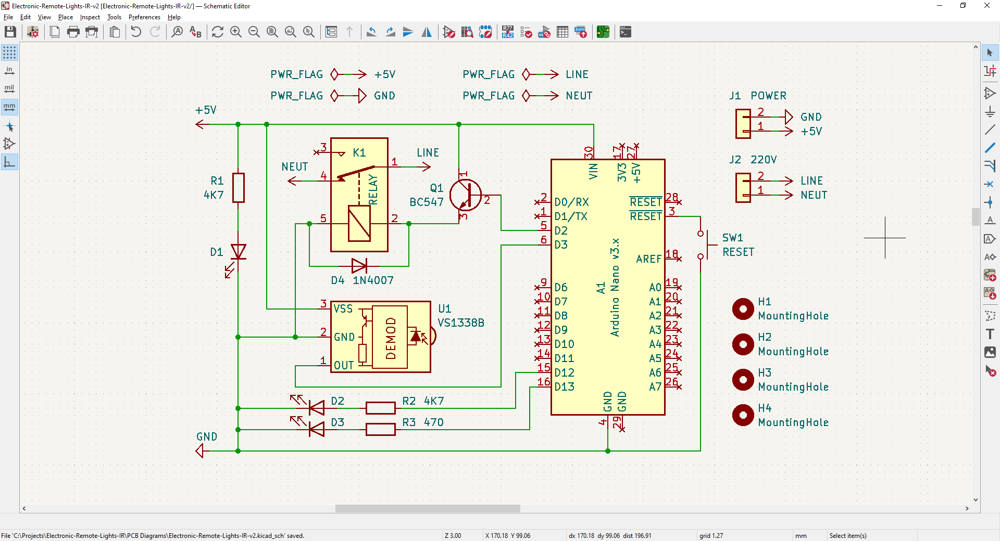
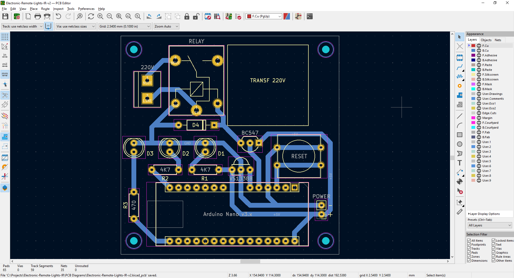
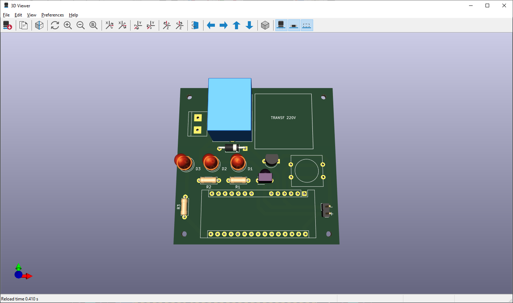
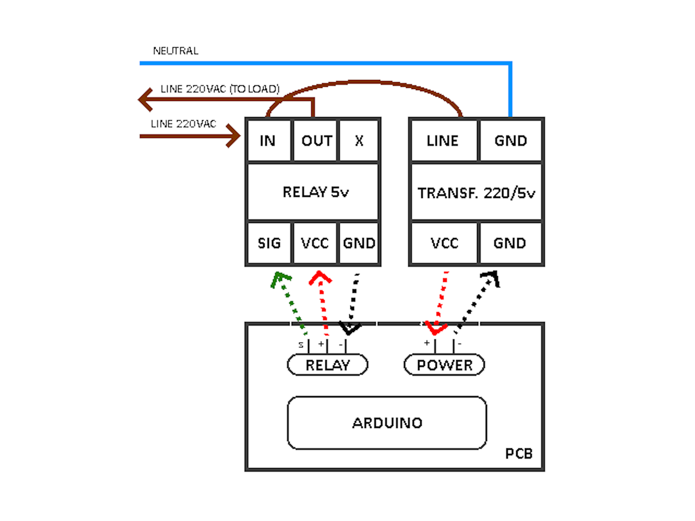

# IR Remote Lights

Electronic proyect to turn lights off/on using an Infrared (IR) remote control, plus sleep operation for low power consumption.  
Kicad PCB diagrams and Blender case 3D models are also provided ;-)

&nbsp;

This project use the following electronic components:
- 1 x Arduino Nano v3.0
- 1 x Infrared sensor VS1838B
- 1 x Relay SRD-05VDC-SL-C (5V)
- 3 x LED 5mm
- 2 x 4.7k ohm resistors
- 1 x 470k ohm resistor
- 1 x ON/OFF button
- 1 x Push-button

The circuit:
- After Arduino starts, external interruptions are enabled on it, and it is puted on sleep mode for low power consumption.
- The IR-sensor is powered directly to 5V (outside from the Arduino).
- When a remote control button is pressed the infrared code is detectec by the IR-sensor.
- The IR-sensor wakeup the Arduino board vía an external interruption (allowed pins 2 & 3).
- The source code uses IRremote v1.4 library to decode the received IR code, and if it is correct, switch on/off a relay.
- The relay is connected in series within the regular light powering wire.

Notes:
- IR Codes changes from remote control to remote control.
- You can look after your's remote control codes conecting the IR sensor to the Arduino board, and within the Arduino IDE using the serial monitor.
- The provided source code can do this for your, just make sure to change the DEBUG macro value to 'true'.

&nbsp;

### Screenshots

| Diagram - Schematics                               | Diagram - PCB                                      |
|----------------------------------------------------|----------------------------------------------------|
|             |                   |
| Diagram - PCB Render                               | Diagram - PCB Render                               |
|----------------------------------------------------|----------------------------------------------------|
|         |          |
| Case - 3D Model                                    | Prototype                                          |
|----------------------------------------------------|----------------------------------------------------|
|                 |                     |
| PCB Manufacturing                                  | PCB Assembly                                       |
|----------------------------------------------------|----------------------------------------------------|
|             |                  |
| Project Assembly                                   | Diagram - Electric Connections                     |
|----------------------------------------------------|----------------------------------------------------|
|              |  |
| Project Final                                      | Project Final (YouTube video)                      |
|----------------------------------------------------|----------------------------------------------------|
|             |             |

See 'Rescources' sub-folder for more pictures & videos of the project.

&nbsp;

### Version History

v1.0 (2023.05.07) - Initial release.  
v1.1 (2023.05.08) - Adding use of sleep mode + interrupts to reduce power consumption.  
v1.2 (2023.05.11) - Rearrange assigned pins to improve PCB design.  
v1.3 (2023.05.20) - Rearrange assigned pins to improve PCB design.

&nbsp;

This source code is licensed under GPL v3.0  
Please send me your feedback about this project: andres.garcia.alves@gmail.com
